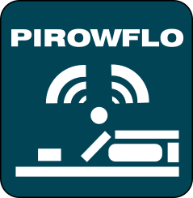
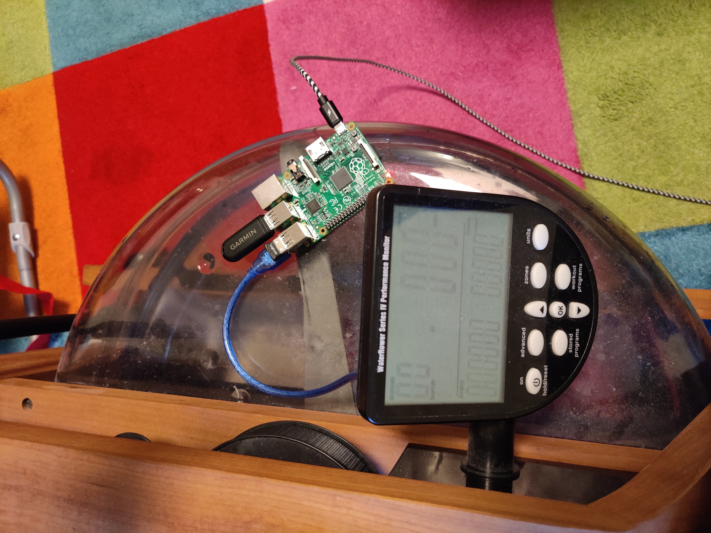
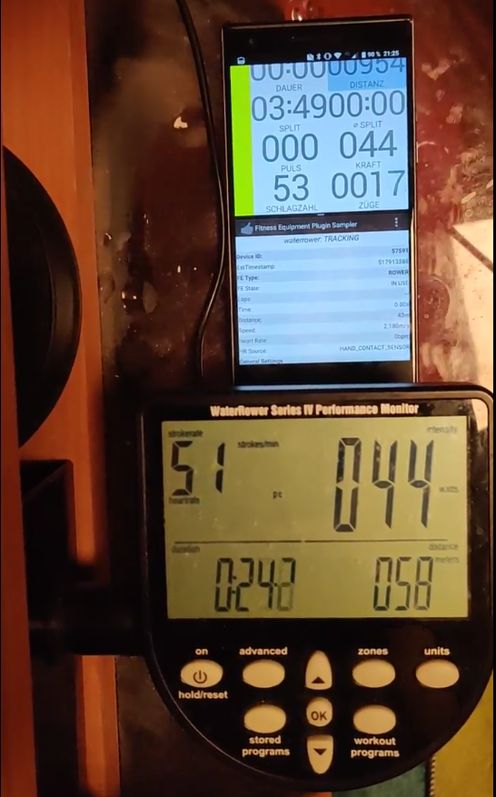
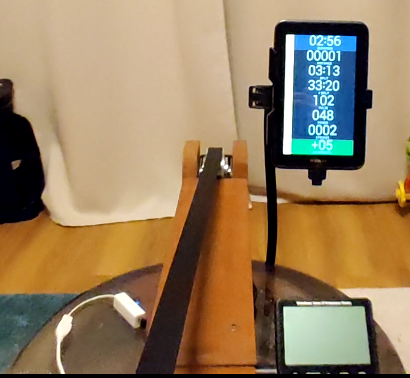
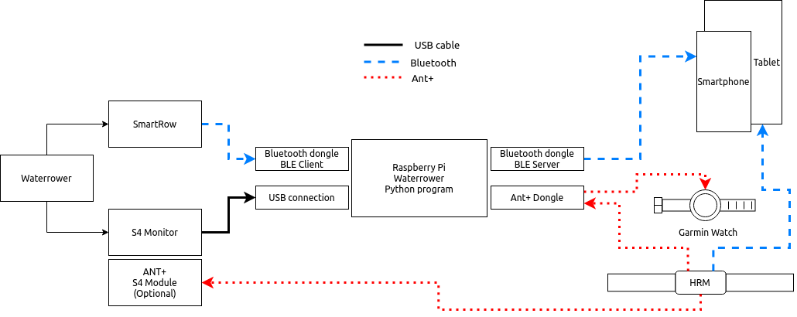
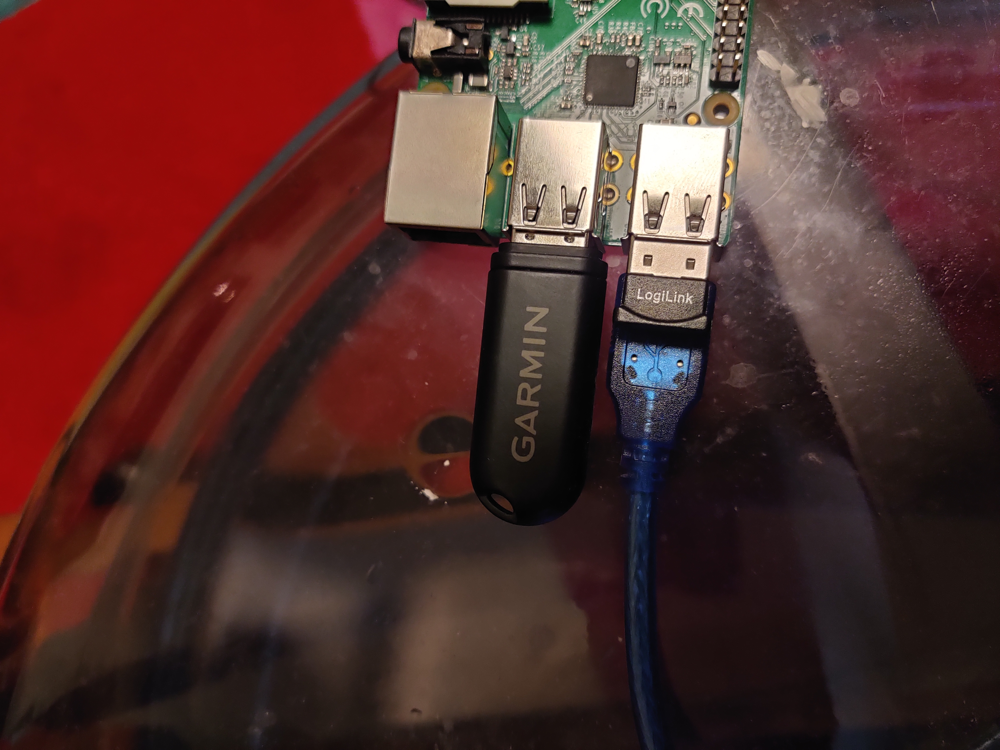
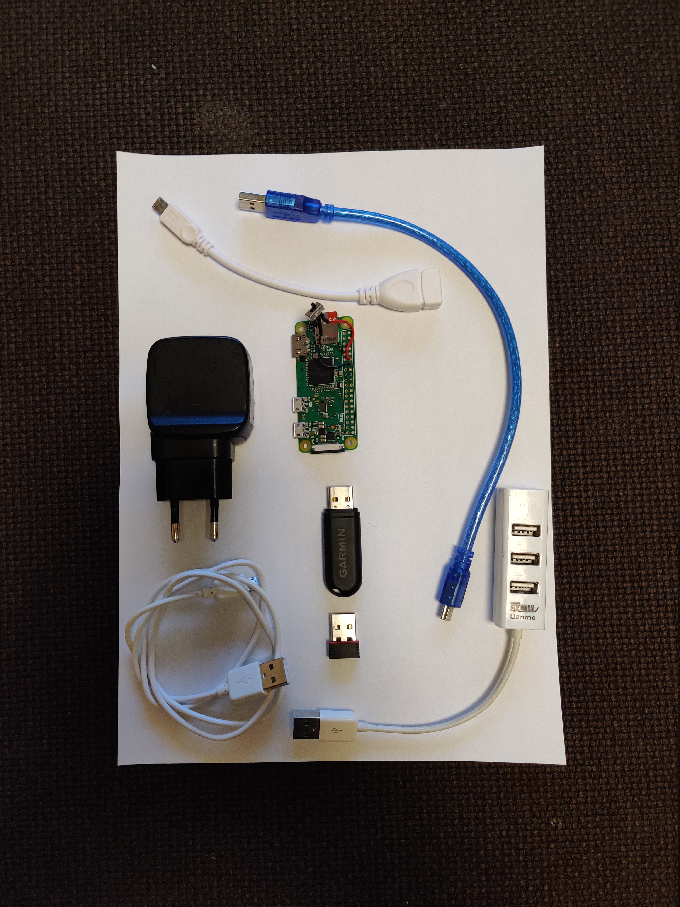
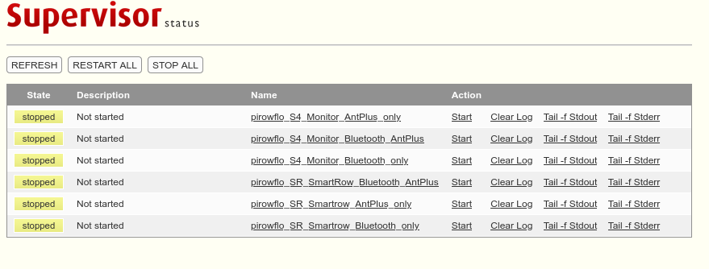
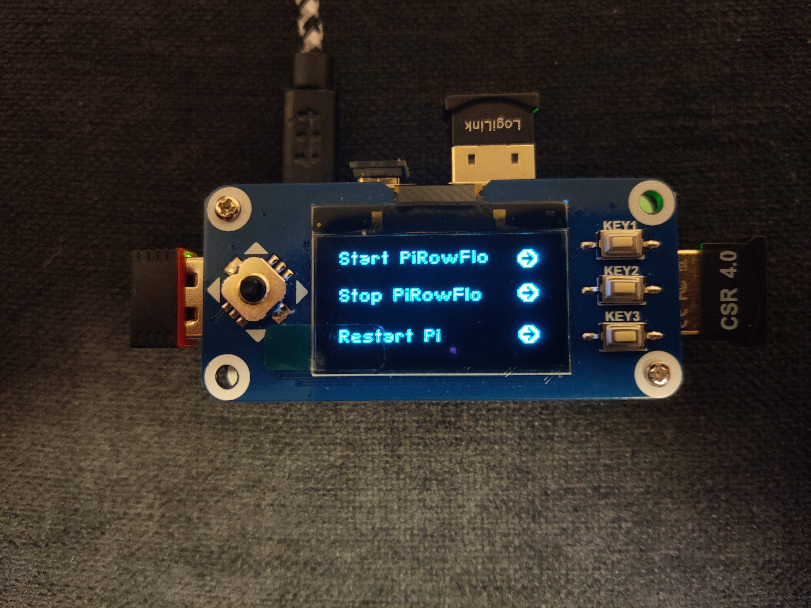

# PiRowFlo for Waterrower

03.03.2022: SmartRow version 3.0 is now working. Thanks to Dan !!
14.11.2021: fixed pip install issue with pyusb in requirements.txt

---- 

  

Read the LICENCE first, by using this software you agree to the licence. 

## News 13.02.2021 

- Case is still in Prototype stage 

## Supported Apps S4 Monitor (23.02.2021)

|        | Kinomap (BLE) | Cityrowgo (BLE)      | waterrower connect (BLE)   | Coxswain (BLE) 7.9 or higher | Holofit| 
|:------:|:------:       |:------------:      |:-----:                     |:-------:                     |:-------:     
|Android | test pending  | :heavy_check_mark: | devs need to update app                  | :heavy_check_mark:           |  :heavy_check_mark:           |
|iOS     | :heavy_check_mark:  | :heavy_check_mark: | :heavy_check_mark:         |  -                           | :heavy_check_mark:           |

## Supported Apps SmartRow (23.02.2021)

|        | Kinomap (BLE) | Cityrowgo (BLE)      | waterrower connect (BLE)   | Coxswain (BLE) 7.9 or higher |Holofit | 
|:------:|:------:       |:------------:      |:-----:                     |:-------:                     |:-------:  |
|Android | test pending  | test pending | devs need to update app                   | :heavy_check_mark:           |  :heavy_check_mark:           |
|iOS     | :heavy_check_mark: | :heavy_check_mark:   | :heavy_check_mark:         |  -                           | :heavy_check_mark:           |

## Supported Watches (14.01.2021)

|   Watch model     |  Navtive rowing App  | ErgIQ|
|:------:|:------: |:------: |
| Fenix 6 | :heavy_check_mark:  | currently not|

## Project Overview

## Features

- Read Serial Waterrower Data to the Pi
- Read SmartRow data to the Pi via bluetooth (for pi 3,4 and Zero W internal bluetooth + USB Bluetooth dongle needed - 
  for pi 1,2,3 without internal bluetooth 2 USB bluetooth dongle from different brands are needed)
- Send Waterrower Data from the Pi over Bluetooth (Build-in or USB-dongle) 
- Send Waterrower Data from the Pi over Ant+ via Ant+ dongle 

## Motivation

I wanted to have the ability to use the Android App Coxswain and also my Garmin smartwatch. Therefore, I though
why not connect the Waterrower via USB to a Raspberry pi and let the Raspberry pi being a BLE and Ant+ transmitter. 
And wouldn't be even better if it could be control for the Webbrowser. And Last but not least, have at the 
end of the training a FIT file for Garmin connect or Strava.

With a high demand from people having the Smartrow, I thought why not trying to integrate it as input interface 
for this project. So it would be either S4 Monitor or Smartrow 

## Target of the project 

## Requirements

### Hardware 

Bill of Material(BOM)

| **Item for Raspberry pi 1,2,3**| 
|------|
| Raspberry Pi || 
| Micro SD card || 
| Mini USB to USB typ A ||  
| Bluetooth USB dongle (not 5.0) (LogiLink BT0015) || 
| Micro USB to Typ A || 
| 5V USB power supply 2A ||
| **for Ant+ addition** || 
| Ant+ dongle (avoid CYCPLUS) ||
| **for Smartrow** || 
| Bluetooth USB dongle (not 5.0) (LogiLink BT0015) || 
| Bluetooth USB dongle (not 5.0) (Mandatory to be different brand)

| **Item for Raspberry pi 3,4**| 
|------|
| Raspberry Pi || 
| Micro SD card || 
| Mini USB to USB typ A ||
| 5V USB power supply 2A ||
| **for Ant+ addition** || 
| Ant+ dongle (avoid CYCPLUS) ||
| **for Smartrow** || 
| Bluetooth USB dongle (not 5.0) (LogiLink BT0015) || 
| ~~Bluetooth USB dongle (not 5.0) (Mandatory to be different brand)~~

| **Item for Raspberry pi Zero W** | 
|------|
| Raspberry Pi Zero W || 
| Micro SD card || 
| Mini USB to Micro USB || 
| 5V USB power supply 2A ||
| **for Ant+ addition**  || 
| Ant+ dongle (avoid CYCPLUSe) ||
| Micro USB to USB Hub || 
| **for Smartrow** || 
| Bluetooth USB dongle (not 5.0) (LogiLink BT0015) || 
| ~~Bluetooth USB dongle (not 5.0) (Mandatory to be different brand)~~

I would recommend buying the Raspberry pi in a kit where most of the parts are included 

### Software 

### Installation
On a fresh installed Raspbian, git must be installed first 

    sudo apt-get install git

Clone the repo from Github: 

    git clone https://github.com/inonoob/pirowflo.git 
    
go into the folder: 

    cd pirowflo 

make install.sh executable: 

    sudo chmod +x install.sh

execute install.sh in order to setup everything: (This can take 5 - 10 min to set all up). If during the first installation
you hadn't have your Ant+ dongle. Just re-run the script and it will install the missing Ant+ and udev profiles.

    sudo ./install.sh 

Once installation and reboot complete, go into the pirowflo/src folder

    cd /home/pi/pirowflo/src

### Getting Started

Start PiRowFlo from the webserver which is available under the: 

http://"raspberry-pi-IP":9001 

or 

Use the Screen to start PiRowFlo

or 

start PiRowFlo from console 

If the script waterrowerthreads is started with -h or --help it shows the available option for the program 

    python3 waterrowerthreads.py -h
    
    usage: waterrowerthreads.py [-h] [-i {s4,sr}] [-b] [-a]

    Python script to broadcast waterrower data over BLE and ANT

      PiRowFlo for Waterrower
                                                                 +-+
                                               XX+-----------------+
                  +-------+                 XXXX    |----|       | |
                   +-----+                XXX +----------------+ | |
                   |     |             XXX    |XXXXXXXXXXXXXXXX| | |
    +--------------X-----X----------+XXX+------------------------+-+
    |                                                              |
    +--------------------------------------------------------------+

    To begin choose an interface from where the data will be taken from either the 
    S4 Monitor connected via USB or the smartrow pulley via bluetooth low energy
    
    Then select which broadcast methode will be used. Bluetooth low energy or Ant+ or both.
    
    e.g. use the S4 connected via USB and broadcast data over bluetooth and Ant+
    
    python3 waterrowerthreads.py -i s4 -b -a
    
    optional arguments:
      -h, --help            show this help message and exit
      -i {s4,sr}, --interface {s4,sr}
                            choose  Waterrower interface S4 monitor: s4 or Smartrow: sr
      -b, --blue            Broadcast Waterrower data over bluetooth low energy
      -a, --antfe           Broadcast Waterrower data over Ant+

For example if the Waterrower should send data over Bluetooth and ANT 

    python3 waterrowerthreads.py -i s4 -b -a 

## Manual update 

The PiRowFlo autoupdate function is not yet implemented. Therefore, we recommend to perform the update as follows: 

    git pull https://github.com/inonoob/pirowflo.git 

And then start the installation script again

    sudo ./install.sh 

## FAQ 

---

I got the error: 

    serial open error waiting

if that is the case, check if your $USER belongs to the group "dialout"

    pi@raspberrypi:/dev $ groups
    pi adm dialout cdrom sudo audio video plugdev games users input netdev gpio i2c spi

if you don't see the "dialout", then your $USER needs to be add to this group 

    sudo usermod -a -G dialout $USER 

Then you need to log out or reboot that it takes effect. 

---

I can't connect with the app Coxswain: 

It is only working with Coxswain version higher 7.9. as the low version haven't the improved connectivity code for 
bluetooth. 

--- 

If you see this kind of error in the console you

    2021-01-16 19:59:14,341 - fakesmartrowble - CRITICAL - Failed to register advertisement: org.bluez.Error.Failed: Failed to register advertisement
    Exception in thread Thread-2:
    Traceback (most recent call last):
      File "/usr/lib/python3.7/threading.py", line 917, in _bootstrap_inner
        self.run()
      File "/usr/lib/python3.7/threading.py", line 865, in run
        self._target(*self._args, **self._kwargs)
      File "fakesmartrowthreads.py", line 51, in FakeSmartRowBLE
        FakeSmartRowBLE()
    TypeError: 'NoneType' object is not callable

That means what a client is still connect with the Raspberry pi and must be disconnect first before restarting the 
service. So check on your smartphone or tablet is a connection is still active. The simplest thing to fix is to close
the app and then try again. 

---

if you see this kind of error in the console: 

    pi@raspberrypi:~/pirowflo/src $ python3 waterrowerthreads.py -i s4 -b -a 
    2021-02-15 06:57:00,481 - __main__ - INFO - inferface S4 monitor will be used for data input
    2021-02-15 06:57:00,489 - __main__ - INFO - Waterrower Interface started
    2021-02-15 06:57:00,491 - __main__ - INFO - no interface selected
    2021-02-15 06:57:00,504 - __main__ - INFO - Start BLE Advertise and BLE GATT Server
    2021-02-15 06:57:00,528 - __main__ - INFO - Start Ant and start broadcast data
    start search for dongle
    2021-02-15 06:57:00,585 - dbus.proxies - ERROR - Introspect error on :1.5:/: dbus.exceptions.DBusException: org.freedesktop.DBus.Error.AccessDenied: Rejected send message, 2 matched rules; type="method_call", sender=":1.15" (uid=1000 pid=627 comm="python3 waterrowerthreads.py -i s4 -b -a ") interface="org.freedesktop.DBus.Introspectable" member="Introspect" error name="(unset)" requested_reply="0" destination=":1.5" (uid=0 pid=369 comm="/usr/lib/bluetooth/bluetoothd ")
    2021-02-15 06:57:00,985 - waterrowerinterface - WARNING - port not found retrying in 5s
    Exception in thread Thread-4:

that means that the current user is not in the group "bluetooth". The used to be a bug in the install.sh. But you can
also add it manually with the following command: 

    sudo usermod -a -G bluetooth pi 

This command run as sudo will add the user "pi" to the group "bluetooth". Then reboot in order to take effect.  This should fix the issue. 

In order to check if it had worked, use the following command: 

    pi@raspberrypi:~/pirowflo $ groups
    pi adm dialout cdrom sudo audio video plugdev games users input netdev bluetooth gpio i2c spi

--- 

If you can connect to the PI with your third party app and don't get any data also don't get any data to your watch via ant+ then there is 
a high chance that the connection between S4 Monitor and the Rasbperry pi is not working correctly. 

- Check if you have heard the reset "BEEP" from the S4 Monitor. If not that means that the connection is not correct
  try to unplug and replug it in. 
- Check the usb cable first. Try a different one. Cheap one tend to break as you need to plug and unplug it. 

## Parts of the code based on following Repos:

- [Link to repo](https://github.com/bfritscher/waterrower) base code used to get the Waterrower Data over USB Interface 
- [Link to repo](https://github.com/PunchThrough/espresso-ble) base code for the BLE GATT server and Advertiser example which
is self based on the Bluez Gatt server example
- [Link to repo](https://github.com/WouterJD/FortiusANT) base code for the Ant+ part used for this project
- [Link to repo](https://github.com/techdiem/RasPi-OLED-Menu) base code for the Screen part used for this project

Those Repos with some of their code are used as  base code 
which then have been rewritten to meet the requirements of this project. 
